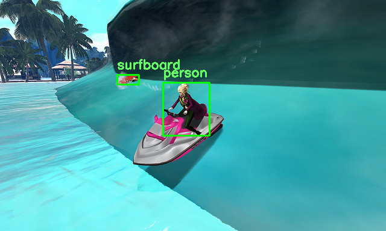
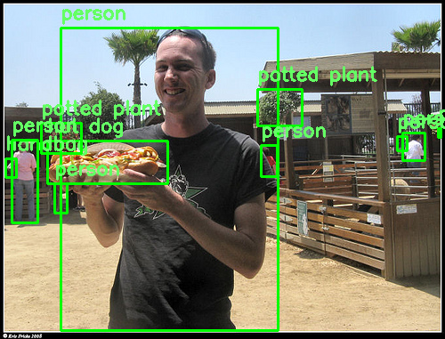
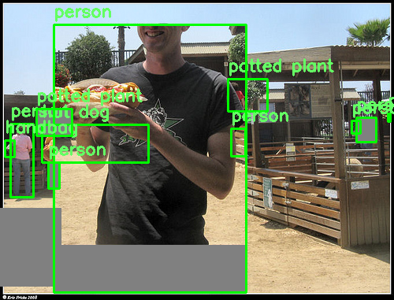

# learn_aug_for_object_detection.numpy
Learning Data Augmentation Strategies for Object Detection in numpy

## Acknowledge
mainly borrow from https://github.com/tensorflow/tpu/blob/master/models/official/detection/utils/autoaugment_utils.py
convert all tf operators to numpy and PIL

## Usage
```python
image, bboxes = distort_image_with_autoaugment(image, bboxes, policy_name)
```

## Notes
 Recently I use official https://github.com/tensorflow/tpu/blob/master/models/official/detection/utils/autoaugment_utils.py to test on COCO dataset, but I found out mAP is quiet low, only 10.5; then I found 2 bugs in autoaugment_utils.py:
1. in _shift_bbox, if a bbox is out of image range, that is, if min_x > 1.0 or max_x < 0.0 or min_y > 1.0 or max_y < 0.0, here the function doesn't take this into accout, just force clip those invalid bbox's value to 0.0 in _clip_bbox, which will cause min_x or min_y to be 0.95 and max_x or max_y to be 0.05 in _check_bbox_area, finally the out-of-range bbox will be about 0.9x of image width or height.

```python
def _shift_bbox(bbox, image_height, image_width, pixels, shift_horizontal):
  """Shifts the bbox coordinates by pixels.
  Args:
    bbox: 1D Tensor that has 4 elements (min_y, min_x, max_y, max_x)
      of type float that represents the normalized coordinates between 0 and 1.
    image_height: Int, height of the image.
    image_width: Int, width of the image.
    pixels: An int. How many pixels to shift the bbox.
    shift_horizontal: Boolean. If true then shift in X dimension else shift in
      Y dimension.
  Returns:
    A tensor of the same shape as bbox, but now with the shifted coordinates.
  """
  pixels = tf.to_int32(pixels)
  # Convert bbox to integer pixel locations.
  min_y = tf.to_int32(tf.to_float(image_height) * bbox[0])
  min_x = tf.to_int32(tf.to_float(image_width) * bbox[1])
  max_y = tf.to_int32(tf.to_float(image_height) * bbox[2])
  max_x = tf.to_int32(tf.to_float(image_width) * bbox[3])

  if shift_horizontal:
    min_x = tf.maximum(0, min_x - pixels)
    max_x = tf.minimum(image_width, max_x - pixels)
  else:
    min_y = tf.maximum(0, min_y - pixels)
    max_y = tf.minimum(image_height, max_y - pixels)

  # Convert bbox back to floats.
  min_y = tf.to_float(min_y) / tf.to_float(image_height)
  min_x = tf.to_float(min_x) / tf.to_float(image_width)
  max_y = tf.to_float(max_y) / tf.to_float(image_height)
  max_x = tf.to_float(max_x) / tf.to_float(image_width)

  # Clip the bboxes to be sure the fall between [0, 1].
  min_y, min_x, max_y, max_x = _clip_bbox(min_y, min_x, max_y, max_x)
  min_y, min_x, max_y, max_x = _check_bbox_area(min_y, min_x, max_y, max_x)
  return tf.stack([min_y, min_x, max_y, max_x])
```

for example, the original image is 



if I do translation_x of magnitude 10, the 'surfboard' will be wrong, 


this bug exist in all operations that will change bbox's location( shift, shear, rotate)

2. for those bbox-only transforms, like bbox_only_translate_x/y, if there are smaller bboxes inside the target bbox, those smaller bboxes inside don't move together with the target bbox. for example:
original image:



after bbox only translation y:



due to the 'person' box is moved upward, the 'hot dog' in his hand also moves upward, but 'hot dog' bbox still locates at it's original position, so this cause label to be wrong.
3. operations like cutout will cover some small bboxes, but it doesn't move those covered bbox.


And I have some questions about this method:
1. those policies seem to be so strong that they will change original data distribution greatly, and many of them's magnitude is 8~10, which are very strong augmentations.
2. In the paper it says it requires longer to train, so it's unclear the gain is from augmentation or more training images.
3. After fix these bugs, I tried train a 3x fpn, but mAP is still very low.
